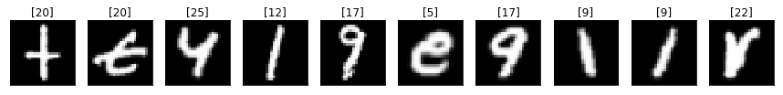

# Alphabet Recognition from Gestures
This deep learning application in python recognizes alphabet through gestures captured real time on a webcam. The user is allowed to write the alphabet on the screen using an object-of-interest.

## Working Implementation


## Resource Requirements
The code is in Python (version 3.6 or higher). You also need to install OpenCV and Keras (2.1.4 version) and tensorflow (1.5 version) libraries.

## Data Description
A popular demonstration of the capability of deep learning techniques is object recognition in image data.

The "Extended Hello World" of object recognition for machine learning and deep learning is the [EMNIST dataset](https://www.kaggle.com/crawford/emnist) for handwritten letters recognition. It is an extended version of the [MNIST](https://en.wikipedia.org/wiki/MNIST_database) dataset.

A set of sample images is shown below.



Each of the letters is stored as a numbered array as shown below.


A Multilayer Perceptron (MLP) model as well as a Convolutional Neural Network (CNN) model using [Keras](https://keras.io/) library. The predictions of both the models are shown on the screen in real time.

The Test accuracies were as follows:

* MLP Test Accuracy: 91.7%
* CNN Test Accuracy: 93.1%

For both the models, I actually used the exact same architectures I implemented in the [Digits Recognition](https://github.com/akshaychandra111/Digits_Recognition_RealTime) project (for obvious 'extended' reasons).

##Execution

Execute ``` mlp_model.py ```  for bulding the Model architecture using Multilayer Perceptron Network

Execute ``` cnn_model.py ``` for building the Model architecture using Convolutional Neural Network.

Execute ``` alpha_recog.py ``` to run the Alphabet detection code.
